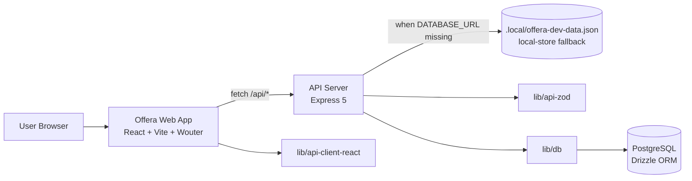
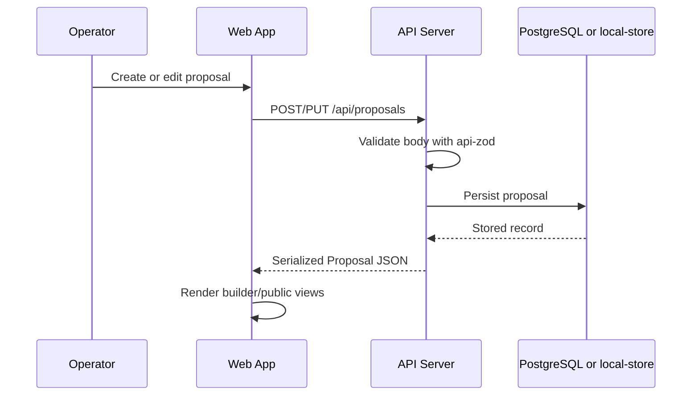
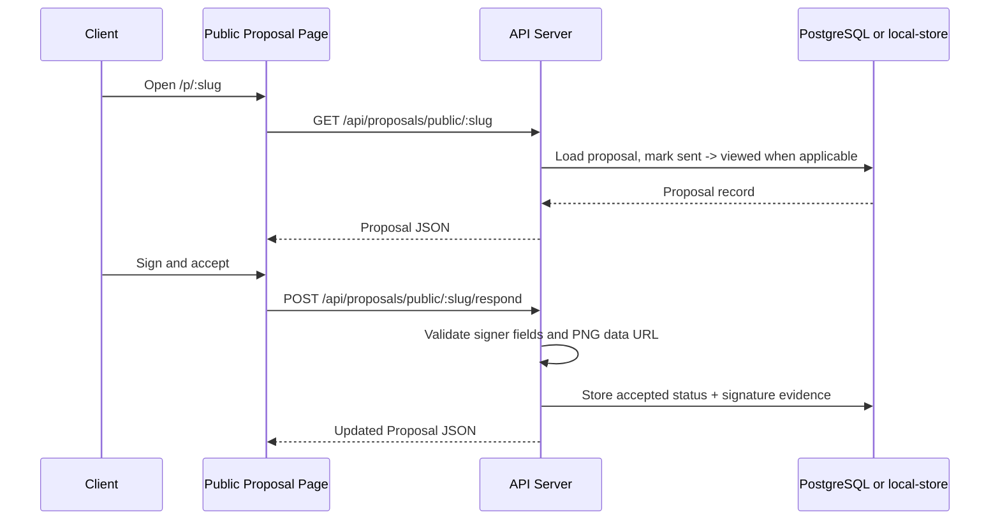
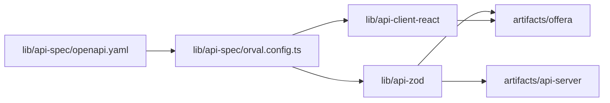

# Architecture

## System Overview

Offera is a monorepo with one primary runtime product and two supporting packages:

- `artifacts/offera`: the customer-facing and operator-facing web application
- `artifacts/api-server`: the HTTP API used by the web app
- `lib/*`: shared contract and persistence packages consumed by both runtime apps

The architecture is contract-first:

1. `lib/api-spec/openapi.yaml` defines the HTTP contract.
2. Orval generates:
   - `lib/api-client-react` for typed frontend API calls and React Query hooks
   - `lib/api-zod` for Zod request/response validators and TypeScript types
3. `artifacts/api-server` implements the routes.
4. `artifacts/offera` consumes the same shapes on the client side.

## Runtime Topology

## Request/Data Flow

### Proposal lifecycle

### Public signing flow

## Contract Generation Pipeline

## Major Parts and How They Connect

### Frontend

- `artifacts/offera/src/App.tsx` creates the React Query client and top-level router.
- Wouter routes split into:
  - operator routes: dashboard, templates, proposal builder
  - public route: `/p/:slug`
- `artifacts/offera/src/lib/api.ts` performs same-origin `fetch` calls against `/api/*` and parses responses with `@workspace/api-zod`.
- `artifacts/offera/src/components/document-builder.tsx` is the central editing surface shared by proposal editing and template editing.

### Backend

- `artifacts/api-server/src/app.ts` configures Express, CORS, JSON parsing, and HTTP logging.
- `artifacts/api-server/src/routes/proposals.ts` and `templates.ts` implement business flows.
- Routes use `@workspace/api-zod` request bodies directly for runtime validation.

### Persistence

- `lib/db/src/schema/proposals.ts` and `templates.ts` define Drizzle table schemas.
- `lib/db/src/index.ts` creates the PostgreSQL connection pool and exports the typed Drizzle client.
- When `DATABASE_URL` is absent, the API switches to `artifacts/api-server/src/lib/local-store.ts`, which persists to `.local/offera-dev-data.json`.

### Design/Preview Support

- `artifacts/mockup-sandbox` is a separate Vite app for previewing mockup components under `/preview/*`.
- `stitch 2/` holds source-of-truth design references used to shape the product UI.

## Runtime Modes

### Database-backed mode

- Trigger: `DATABASE_URL` is present
- Storage: PostgreSQL
- Access layer: Drizzle ORM
- Built-in templates: seeded lazily on `GET /api/templates`

### Local fallback mode

- Trigger: `DATABASE_URL` is absent
- Storage: `.local/offera-dev-data.json`
- Access layer: `local-store.ts`
- Built-in templates: created automatically inside the JSON store

## Technology Choices and Why They Exist

- `pnpm workspaces`: shared dependencies plus clean separation between deployable artifacts and generated/shared libraries.
- `TypeScript project references`: lets shared libraries emit declarations once and keeps cross-package imports type-safe.
- `OpenAPI + Orval`: ensures frontend hooks, request bodies, and server-side validators come from one schema.
- `Express 5`: lightweight HTTP layer that fits the current small API surface.
- `Drizzle ORM`: typed SQL schema with minimal abstraction and easy JSONB support for flexible proposal content.
- `JSONB columns`: proposals and templates store section/block trees without over-normalizing the document model.
- `React Query`: caches proposals/templates and simplifies mutation invalidation.
- `Wouter`: small router suited to a Vite SPA without introducing a heavier framework router.
- `Radix UI + shadcn-style wrappers`: accessible primitives with project-specific styling.
- `Framer Motion`: used selectively for high-polish modal and preview interactions.
- `react-signature-canvas`: provides handwritten signature capture without a custom canvas implementation.

## Known Architectural Gaps

> ⚠️ Unclear: `replit.md` still describes a `GET /api/health` route, while the actual implementation and artifact health check use `GET /api/healthz`.

> ⚠️ Unclear: `cookie-parser` is installed in the API package but not mounted in `src/app.ts`, which suggests planned but unfinished session or cookie work.
