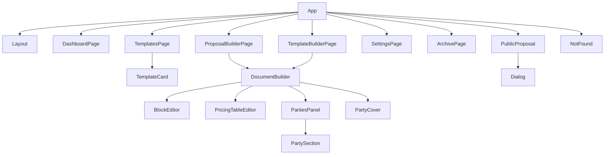

# Components

## Frontend Composition

## Route Components

| File                                              | Component                | Props | Local State                                                                                                                                                        | Purpose                                                                                            |
| ------------------------------------------------- | ------------------------ | ----- | ------------------------------------------------------------------------------------------------------------------------------------------------------------------ | -------------------------------------------------------------------------------------------------- |
| `artifacts/offera/src/App.tsx`                    | `App`, internal `Router` | None  | None                                                                                                                                                               | Creates the Query Client, provides tooltip/toast context, and mounts Wouter routes.                |
| `artifacts/offera/src/pages/dashboard.tsx`        | `DashboardPage`          | None  | `search`, `statusFilter`                                                                                                                                           | Lists proposals, filters/searches them, and opens or deletes proposals.                            |
| `artifacts/offera/src/pages/templates.tsx`        | `TemplatesPage`          | None  | `search`, `category`, `isCreating`                                                                                                                                 | Lists built-in and custom templates, supports delete/copy, and starts new proposal/template flows. |
| `artifacts/offera/src/pages/template-builder.tsx` | `TemplateBuilderPage`    | None  | `draft`, `initialSnapshot`, `isSaving`, `isCopying`                                                                                                                | Creates or edits templates using the shared document builder.                                      |
| `artifacts/offera/src/pages/builder.tsx`          | `ProposalBuilderPage`    | None  | `proposal`, `isSaving`, `isSending`, `sendModalOpen`, `sendEmail`, `sendMessage`, `saveTemplateModalOpen`, `isSavingTemplate`, `templateState`                     | Edits a proposal, sends it to a client, and converts it into a reusable template.                  |
| `artifacts/offera/src/pages/public-proposal.tsx`  | `PublicProposal`         | None  | `isResponding`, `latestProposal`, `signatureModalOpen`, `signerName`, `initials`, `termsAccepted`, `hasSignature`, `signatureCanvasWidth`, `signatureDraftDataUrl` | Renders the client-facing proposal and handles accept/decline plus handwritten signature capture.  |
| `artifacts/offera/src/pages/not-found.tsx`        | `NotFound`               | None  | None                                                                                                                                                               | Fallback 404 screen.                                                                               |
| `artifacts/offera/src/pages/settings.tsx`         | `SettingsPage`           | None  | `isUploading`                                                                                                                                                      | Company-profile/settings screen backed by localStorage.                                            |
| `artifacts/offera/src/pages/archive.tsx`          | `ArchivePage`            | None  | `search`                                                                                                                                                           | Lists non-draft proposals as archive history and supports preview, PDF, and restore actions.       |

## Composite App Components

| File                                                | Component      | Props                                                                               | Local State     | Purpose                                                                               |
| --------------------------------------------------- | -------------- | ----------------------------------------------------------------------------------- | --------------- | ------------------------------------------------------------------------------------- |
| `artifacts/offera/src/components/layout.tsx`        | `Layout`       | `children`                                                                          | `isSidebarOpen` | Shared shell for dashboard/template pages with desktop sidebar and mobile bottom nav. |
| `artifacts/offera/src/components/template-card.tsx` | `TemplateCard` | `template`, `onUse`, optional `onEdit`, `onDelete`, `onCopy`, `compact`, `selected` | None            | Shared card for template library presentations and call-to-action handling.           |
| `artifacts/offera/src/components/status-badge.tsx`  | `StatusBadge`  | `status`                                                                            | None            | Maps proposal status to Swedish labels and tonal badge styling.                       |

## `document-builder.tsx` Internal Component Inventory

| Component            | Props                                                                                                                                                  | Local State                               | Purpose                                                                    |
| -------------------- | ------------------------------------------------------------------------------------------------------------------------------------------------------ | ----------------------------------------- | -------------------------------------------------------------------------- |
| `DocumentBuilder`    | `mode`, `title`, `status`, `sections`, `designSettings`, callbacks for title/sections/design save/back, optional actions, notices, parties, createdAt` | `activeTab`, `selectedBlock`, `isPreview` | Main editor canvas shared by proposal and template editing flows.          |
| `HighlightedText`    | `value`, optional `className`, optional `as`                                                                                                           | None                                      | Highlights placeholder tokens like `{{kundnamn}}` inside preview text.     |
| `SectionDivider`     | `designSettings`                                                                                                                                       | None                                      | Renders line/space/decorative dividers based on the chosen document style. |
| `BlockEditor`        | `block`, `isPreview`, `isTemplateMode`, `designSettings`, `onChange`, `onDelete`                                                                       | None                                      | Delegates block rendering/editing for each block type.                     |
| `TextBlockEditor`    | `block`, `isTemplateMode`, `onChange`, `onDelete`                                                                                                      | `textareaRef`, `selectionRef` refs        | WYSIWYG-ish text editor with placeholder insertion for template mode.      |
| `PricingTableEditor` | `block`, `isPreview`, `designSettings`, `onChange`, `onDelete`                                                                                         | None                                      | Edits pricing rows, discount, VAT toggle, and renders totals.              |
| `PartiesPanel`       | `parties`, `onChange`                                                                                                                                  | None                                      | Full-screen legal/party information form for sender and recipient.         |
| `PartySection`       | `title`, `description`, `party`, `primaryLabel`, `showOrgNumber`, `onChange`                                                                           | None                                      | Shared form layout for sender/recipient data entry.                        |
| `PartyCover`         | `parties`, `designSettings`                                                                                                                            | None                                      | Renders a polished sender/recipient summary inside the document preview.   |
| `FieldInput`         | `label`, `value`, `onChange`, optional `className`, `placeholder`, `type`                                                                              | None                                      | Small styled form helper used in `PartySection`.                           |

## Hooks and Frontend Modules

| File                                                 | Export                                        | State                       | Purpose                                                                                                                          |
| ---------------------------------------------------- | --------------------------------------------- | --------------------------- | -------------------------------------------------------------------------------------------------------------------------------- |
| `artifacts/offera/src/hooks/use-toast.ts`            | `useToast`, `toast`, `reducer`                | Global in-memory toast list | App-level toast notification system layered over Radix toast primitives.                                                         |
| `artifacts/offera/src/hooks/use-mobile.tsx`          | `useIsMobile`                                 | `isMobile`                  | Media-query helper for responsive behavior.                                                                                      |
| `artifacts/offera/src/hooks/use-company-settings.ts` | `useCompanySettings`, `CompanySettingsSchema` | `settings`                  | LocalStorage-backed company profile settings, including logo compression.                                                        |
| `artifacts/offera/src/lib/api.ts`                    | `api`                                         | None                        | Handwritten frontend API client that validates inputs and parses outputs with `@workspace/api-zod`.                              |
| `artifacts/offera/src/lib/document.ts`               | many helper exports                           | None                        | Domain helpers for creating sections/blocks, computing totals, formatting, filtering templates, and normalizing design settings. |

## Mockup Sandbox Modules

| File                                                | Component/Module                    | Props                                                 | Local State                    | Purpose                                                                      |
| --------------------------------------------------- | ----------------------------------- | ----------------------------------------------------- | ------------------------------ | ---------------------------------------------------------------------------- |
| `artifacts/mockup-sandbox/src/App.tsx`              | `App`, `PreviewRenderer`, `Gallery` | `PreviewRenderer` takes `componentPath` and `modules` | `Component`, `error`           | Loads arbitrary mockup components under `/preview/*` for isolated rendering. |
| `artifacts/mockup-sandbox/mockupPreviewPlugin.ts`   | `mockupPreviewPlugin`               | Vite plugin options from Vite itself                  | internal refresh/watcher state | Discovers previewable mockups and regenerates the import registry.           |
| `artifacts/mockup-sandbox/src/hooks/use-toast.ts`   | `useToast`, `toast`                 | Same as product app                                   | in-memory toast store          | Sandbox copy of the toast system.                                            |
| `artifacts/mockup-sandbox/src/hooks/use-mobile.tsx` | `useIsMobile`                       | None                                                  | `isMobile`                     | Sandbox copy of the breakpoint hook.                                         |

## UI Primitive Modules

All files under `artifacts/offera/src/components/ui/` are reusable modules. Unless noted otherwise, their exports inherit the props of their underlying Radix primitive or HTML element and keep state inside Radix rather than local React state.

| File                  | Main Exports                                                         | State                               | Purpose                                                                                          |
| --------------------- | -------------------------------------------------------------------- | ----------------------------------- | ------------------------------------------------------------------------------------------------ |
| `accordion.tsx`       | `Accordion`, `AccordionItem`, `AccordionTrigger`, `AccordionContent` | Radix-managed                       | Collapsible content sections.                                                                    |
| `alert-dialog.tsx`    | `AlertDialog*` family                                                | Radix-managed                       | Confirm/destructive modal dialogs.                                                               |
| `alert.tsx`           | `Alert`, `AlertTitle`, `AlertDescription`                            | None                                | Inline status/message panel.                                                                     |
| `aspect-ratio.tsx`    | `AspectRatio`                                                        | None                                | Fixed-ratio layout container.                                                                    |
| `avatar.tsx`          | `Avatar`, `AvatarImage`, `AvatarFallback`                            | Radix-managed                       | User/avatar display.                                                                             |
| `badge.tsx`           | `Badge`, `badgeVariants`                                             | None                                | Variant badge/chip component.                                                                    |
| `breadcrumb.tsx`      | `Breadcrumb*` family                                                 | None                                | Breadcrumb navigation primitives.                                                                |
| `button-group.tsx`    | `ButtonGroup*`, `buttonGroupVariants`                                | None                                | Visual grouping of adjacent buttons.                                                             |
| `button.tsx`          | `Button`, `buttonVariants`                                           | None                                | Shared button system with `variant` and `size`.                                                  |
| `calendar.tsx`        | `Calendar`, `CalendarDayButton`                                      | Internal day-picker state           | Date picker/calendar wrapper.                                                                    |
| `card.tsx`            | `Card*` family                                                       | None                                | Generic surfaced content card.                                                                   |
| `carousel.tsx`        | `Carousel*` family                                                   | Local context                       | Embla-backed carousel wrapper.                                                                   |
| `chart.tsx`           | `ChartContainer`, `ChartTooltip*`, `ChartLegend*`                    | React context                       | Recharts wrapper that injects chart-scoped CSS variables and shared config.                      |
| `checkbox.tsx`        | `Checkbox`                                                           | Radix-managed                       | Boolean toggle checkbox.                                                                         |
| `collapsible.tsx`     | `Collapsible*` family                                                | Radix-managed                       | Simple expand/collapse primitive.                                                                |
| `command.tsx`         | `Command*` family                                                    | Command state internal to library   | Command palette/search menu wrapper.                                                             |
| `context-menu.tsx`    | `ContextMenu*` family                                                | Radix-managed                       | Right-click context menus.                                                                       |
| `dialog.tsx`          | `Dialog*` family                                                     | Radix-managed                       | General modal dialog primitive.                                                                  |
| `drawer.tsx`          | `Drawer*` family                                                     | Vaul-managed                        | Mobile-friendly bottom/side drawer.                                                              |
| `dropdown-menu.tsx`   | `DropdownMenu*` family                                               | Radix-managed                       | Action menus and nested dropdowns.                                                               |
| `empty.tsx`           | `Empty*` family                                                      | None                                | Empty-state layout primitives.                                                                   |
| `field.tsx`           | `Field*` family                                                      | None                                | Form field composition helpers.                                                                  |
| `form.tsx`            | `Form`, `FormField`, `useFormField`, related helpers                 | React context                       | React Hook Form adapters.                                                                        |
| `hover-card.tsx`      | `HoverCard*` family                                                  | Radix-managed                       | Hover-triggered info card.                                                                       |
| `input-group.tsx`     | `InputGroup*` family                                                 | None                                | Structured input rows with add-ons, buttons, and embedded controls.                              |
| `input-otp.tsx`       | `InputOTP*` family                                                   | Component/library-managed           | OTP entry fields.                                                                                |
| `input.tsx`           | `Input`                                                              | None                                | Styled text input.                                                                               |
| `item.tsx`            | `Item*` family                                                       | None                                | Generic list/item composition helper.                                                            |
| `kbd.tsx`             | `Kbd`, `KbdGroup`                                                    | None                                | Keyboard shortcut styling.                                                                       |
| `label.tsx`           | `Label`                                                              | None                                | Styled label wrapper.                                                                            |
| `menubar.tsx`         | `Menubar*` family                                                    | Radix-managed                       | Desktop menubar primitives.                                                                      |
| `navigation-menu.tsx` | `NavigationMenu*`, `navigationMenuTriggerStyle`                      | Radix-managed                       | Complex navigation menu primitives.                                                              |
| `pagination.tsx`      | `Pagination*` family                                                 | None                                | Pagination UI building blocks.                                                                   |
| `popover.tsx`         | `Popover*` family                                                    | Radix-managed                       | Small anchored overlay.                                                                          |
| `progress.tsx`        | `Progress`                                                           | Radix-managed                       | Linear progress indicator.                                                                       |
| `radio-group.tsx`     | `RadioGroup`, `RadioGroupItem`                                       | Radix-managed                       | Single-choice radio controls.                                                                    |
| `resizable.tsx`       | `ResizablePanelGroup`, `ResizablePanel`, `ResizableHandle`           | Library-managed                     | Split panes.                                                                                     |
| `scroll-area.tsx`     | `ScrollArea`, `ScrollBar`                                            | Radix-managed                       | Styled scroll containers.                                                                        |
| `select.tsx`          | `Select*` family                                                     | Radix-managed                       | Select/dropdown field wrapper.                                                                   |
| `separator.tsx`       | `Separator`                                                          | None                                | Visual separator.                                                                                |
| `sheet.tsx`           | `Sheet*` family                                                      | Radix-managed                       | Slide-over sheet UI.                                                                             |
| `sidebar.tsx`         | `Sidebar*` family, `SidebarProvider`, `useSidebar`                   | `open`, `openMobile`, context state | General-purpose responsive sidebar system with cookie persistence and keyboard shortcut support. |
| `skeleton.tsx`        | `Skeleton`                                                           | None                                | Loading placeholder.                                                                             |
| `slider.tsx`          | `Slider`                                                             | Radix-managed                       | Range slider.                                                                                    |
| `sonner.tsx`          | `Toaster`                                                            | Library-managed                     | Sonner toast bridge.                                                                             |
| `spinner.tsx`         | `Spinner`                                                            | None                                | Loading spinner primitive.                                                                       |
| `switch.tsx`          | `Switch`                                                             | Radix-managed                       | Boolean switch control.                                                                          |
| `table.tsx`           | `Table*` family                                                      | None                                | Table layout primitives.                                                                         |
| `tabs.tsx`            | `Tabs`, `TabsList`, `TabsTrigger`, `TabsContent`                     | Radix-managed                       | Tabbed content.                                                                                  |
| `textarea.tsx`        | `Textarea`                                                           | None                                | Styled multiline text field.                                                                     |
| `toast.tsx`           | `Toast*` family                                                      | Radix-managed                       | Toast item primitive layer.                                                                      |
| `toaster.tsx`         | `Toaster`                                                            | Reads global toast store            | Mount point for current app toasts.                                                              |
| `toggle-group.tsx`    | `ToggleGroup`, `ToggleGroupItem`                                     | React context/Radix                 | Multi-toggle control group.                                                                      |
| `toggle.tsx`          | `Toggle`, `toggleVariants`                                           | Radix-managed                       | Single toggle button.                                                                            |
| `tooltip.tsx`         | `Tooltip`, `TooltipTrigger`, `TooltipContent`, `TooltipProvider`     | Radix-managed                       | Tooltip layer.                                                                                   |

## Notes

> ⚠️ Unclear: The product ships with both `toast.tsx`/`toaster.tsx` and `sonner.tsx`. The current app uses the Radix-based toast stack, while the Sonner wrapper is present but not used by the main pages.
