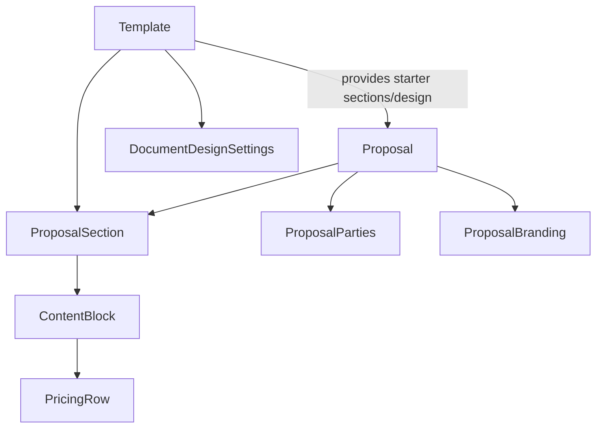

# Data Models

## Domain Model Overview

Offera revolves around two primary aggregates:

- `Proposal`: a customer-facing sales document that can be drafted, sent, viewed, accepted, or declined
- `Template`: a reusable blueprint for future proposals

Both aggregates store their body content as ordered `sections`, and each section contains `blocks`.

## Core API Schemas

### `HealthStatus`

```ts
{
  status: string;
}
```

### `ProposalStatus`

- `draft`
- `sent`
- `viewed`
- `accepted`
- `declined`

### `TemplateCategory`

- `webb`
- `ai-agent`
- `konsult`
- `ovrigt`

### `PricingRow`

```ts
{
  id: string;
  description: string;
  quantity: number;
  unitPrice: number;
  total: number;
}
```

### `ContentBlock`

```ts
{
  id: string
  type: "heading" | "text" | "image" | "pricing" | "divider"
  content?: string
  rows?: PricingRow[]
  discount?: number
  vatEnabled?: boolean
  imageUrl?: string
  level?: number
}
```

Interpretation by `type`:

- `heading`: uses `content` and optional `level`
- `text`: uses `content`
- `image`: uses `imageUrl`
- `pricing`: uses `rows`, `discount`, `vatEnabled`
- `divider`: structural separator, no payload required

### `ProposalSection`

```ts
{
  id: string
  title: string
  blocks: ContentBlock[]
}
```

### `ProposalParty`

```ts
{
  companyName: string;
  orgNumber: string;
  contactName: string;
  email: string;
  phone: string;
  address: string;
  postalCode: string;
  city: string;
}
```

### `ProposalRecipient`

`ProposalRecipient` extends `ProposalParty` with:

```ts
{
  kind: "company" | "person";
}
```

### `ProposalParties`

```ts
{
  sender: ProposalParty;
  recipient: ProposalRecipient;
}
```

### `ProposalBranding`

```ts
{
  logoUrl?: string
  accentColor: string
  font?: "inter" | "playfair" | "dm-sans"
  fontPairing?: "modern" | "klassisk" | "editorial"
  coverEnabled?: boolean
  coverBackground?: string
  coverHeadline?: string
  coverSubheadline?: string
  logoPosition?: "left" | "center" | "right"
  dividerStyle?: "line" | "space" | "decorative"
}
```

### `DocumentDesignSettings`

Used by templates and normalized branding helpers:

```ts
{
  logoUrl?: string
  accentColor: string
  fontPairing: "modern" | "klassisk" | "editorial"
  coverEnabled: boolean
  coverBackground: string
  coverHeadline?: string
  coverSubheadline?: string
  logoPosition: "left" | "center" | "right"
  dividerStyle: "line" | "space" | "decorative"
}
```

### `Proposal`

```ts
{
  id: number
  title: string
  clientName: string
  clientEmail?: string
  status: ProposalStatus
  totalValue: number
  publicSlug: string
  templateId?: number
  sections: ProposalSection[]
  branding: ProposalBranding
  parties: ProposalParties
  personalMessage?: string
  signedByName?: string
  signatureInitials?: string
  signatureDataUrl?: string
  signedAt?: string
  createdAt: string
  updatedAt: string
  lastActivityAt?: string
}
```

### `Template`

```ts
{
  id: number
  name: string
  description?: string
  category: TemplateCategory
  designSettings: DocumentDesignSettings
  isBuiltIn: boolean
  usageCount: number
  sections: ProposalSection[]
  createdAt: string
  updatedAt: string
}
```

## Request Schemas

### `CreateProposalRequest`

```ts
{
  title?: string
  clientName?: string
  clientEmail?: string
  templateId?: number
}
```

### `UpdateProposalRequest`

```ts
{
  title?: string
  clientName?: string
  clientEmail?: string
  sections?: ProposalSection[]
  branding?: ProposalBranding
  parties?: ProposalParties
  totalValue?: number
}
```

### `SendProposalRequest`

```ts
{
  clientEmail: string
  personalMessage?: string
}
```

### `RespondToProposalRequest`

```ts
{
  action: "accept" | "decline"
  signerName?: string
  initials?: string
  signatureDataUrl?: string
  termsAccepted?: boolean
}
```

Validation-specific constraints:

- `signerName`: 1 to 160 chars
- `initials`: 1 to 5 chars
- `signatureDataUrl`: max 500000 chars and must start with `data:image/png;base64,`

### `CreateTemplateRequest`

```ts
{
  name: string
  description?: string
  category: TemplateCategory
  sections?: ProposalSection[]
  designSettings?: DocumentDesignSettings
  sourceProposalId?: number
}
```

### `UpdateTemplateRequest`

```ts
{
  name?: string
  description?: string
  category?: TemplateCategory
  sections?: ProposalSection[]
  designSettings?: DocumentDesignSettings
}
```

### `CopyTemplateRequest`

```ts
{
  name?: string
  description?: string
  category?: TemplateCategory
}
```

## Persistence Models

### PostgreSQL: `proposals` table

Defined in `lib/db/src/schema/proposals.ts`.

| Column                | Type            | Notes                                         |
| --------------------- | --------------- | --------------------------------------------- |
| `id`                  | `serial`        | Primary key                                   |
| `title`               | `text`          | Required                                      |
| `client_name`         | `text`          | Legacy mirror of recipient company/name       |
| `client_email`        | `text`          | Legacy mirror of recipient email              |
| `status`              | `text`          | Defaults to `draft`                           |
| `total_value`         | `numeric(12,2)` | Stored as numeric string by PostgreSQL driver |
| `public_slug`         | `text`          | Unique public lookup key                      |
| `template_id`         | `integer`       | Optional template linkage                     |
| `sections`            | `jsonb`         | Serialized `ProposalSection[]`                |
| `branding`            | `jsonb`         | Serialized proposal branding                  |
| `parties`             | `jsonb`         | Typed as `ProposalParties`                    |
| `personal_message`    | `text`          | Optional send message                         |
| `signed_by_name`      | `text`          | Acceptance capture                            |
| `signature_initials`  | `text`          | Acceptance capture                            |
| `signature_data_url`  | `text`          | Stored PNG data URL                           |
| `acceptance_evidence` | `jsonb`         | Structured signature evidence                 |
| `signed_at`           | `timestamp`     | Acceptance timestamp                          |
| `created_at`          | `timestamp`     | Defaults now                                  |
| `updated_at`          | `timestamp`     | Defaults now                                  |
| `last_activity_at`    | `timestamp`     | Defaults now                                  |

### PostgreSQL: `templates` table

Defined in `lib/db/src/schema/templates.ts`.

| Column            | Type        | Notes                               |
| ----------------- | ----------- | ----------------------------------- |
| `id`              | `serial`    | Primary key                         |
| `name`            | `text`      | Required                            |
| `description`     | `text`      | Optional                            |
| `category`        | `text`      | Defaults to `ovrigt`                |
| `is_builtin`      | `boolean`   | Defaults false                      |
| `sections`        | `jsonb`     | Serialized `ProposalSection[]`      |
| `design_settings` | `jsonb`     | Serialized `DocumentDesignSettings` |
| `created_at`      | `timestamp` | Defaults now                        |
| `updated_at`      | `timestamp` | Defaults now                        |

## Additional Persistence/Support Types

### `ProposalAcceptanceEvidence`

Stored in proposal records after acceptance:

```ts
{
  signerName: string
  initials: string
  signatureDataUrl: string
  termsAccepted: true
  consentAcceptedAt: string
  ipAddress?: string
  userAgent?: string
}
```

### `StoredProposal`

Defined in `artifacts/api-server/src/lib/local-store.ts`.

- Extends `Proposal`
- Adds `templateId?: number`
- Adds strongly typed `parties`
- Adds optional `acceptanceEvidence`

### `StoreData`

The local JSON persistence envelope:

```ts
{
  nextProposalId: number
  nextTemplateId: number
  proposals: StoredProposal[]
  templates: Template[]
}
```

## Frontend-only Supporting Models

### `EditableTemplate`

Used by `template-builder.tsx` while editing:

```ts
{
  name: string
  description: string
  category: TemplateCategory
  sections: ProposalSection[]
  designSettings: DocumentDesignSettings
}
```

### `SaveTemplateState`

Used by `builder.tsx` when converting a proposal into a template:

```ts
{
  name: string
  category: TemplateCategory
  description: string
  successTemplateId?: number
}
```

### `CompanySettings`

Used by the settings page and by the proposal builder to prefill sender defaults:

```ts
{
  companyName: string
  orgNumber: string
  email: string
  phone: string
  address: string
  website: string
  logoUrl?: string
  defaultCurrency: string
  defaultTaxRate: number
}
```

## Model Relationships



## Notes

> ⚠️ Unclear: The codebase now has two adjacent but not fully unified branding models, `ProposalBranding` and `DocumentDesignSettings`. The helper `normalizeDesignSettings()` bridges them at runtime, but the duplication suggests an evolving model boundary rather than a finished one.
